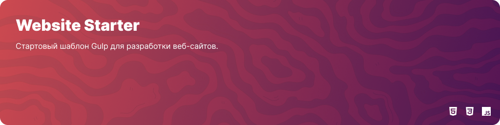

# Website Starter

Стартовый шаблон [Gulp](https://gulpjs.com/) для разработки веб-сайтов.

## Состав сборки:

- **[Babel](https://babeljs.io/)** – поддержка JS в старых браузерах;
- **[PostCSS](https://babeljs.io/)** – поддержка в старых браузерах и отимизация CSS кода;
- **[Terser](https://terser.org/)** – сжатие и оптимизации JS;
- **[CSSNANO](https://cssnano.co/)** – сжатие и оптимизации CSS;
- **[Autoprefixer](https://autoprefixer.github.io/)** – установка вендорных префиксов CSS;
- **[ESlint](https://eslint.org/)** – автоматическая проверка JS кода. _Для работы eslint в vscode установите [плагин](https://marketplace.visualstudio.com/items?itemName=dbaeumer.vscode-eslint)_;
- **[Prettier](https://prettier.io/)** – автоматическая стилизация кода. _Для работы prettier в vscode установите [плагин](https://marketplace.visualstudio.com/items?itemName=esbenp.prettier-vscode)_.

## Команды

- `start` – запуск режима разработки, с отслеживанием изменений;
- `clean` – удаление каталога и архива с собранным проектом;
- `build` – сборка проекта;
- `archive` – сборка проекта с запаковкой в zip архив;
- `deploy` – публикация проекта на github pages.
